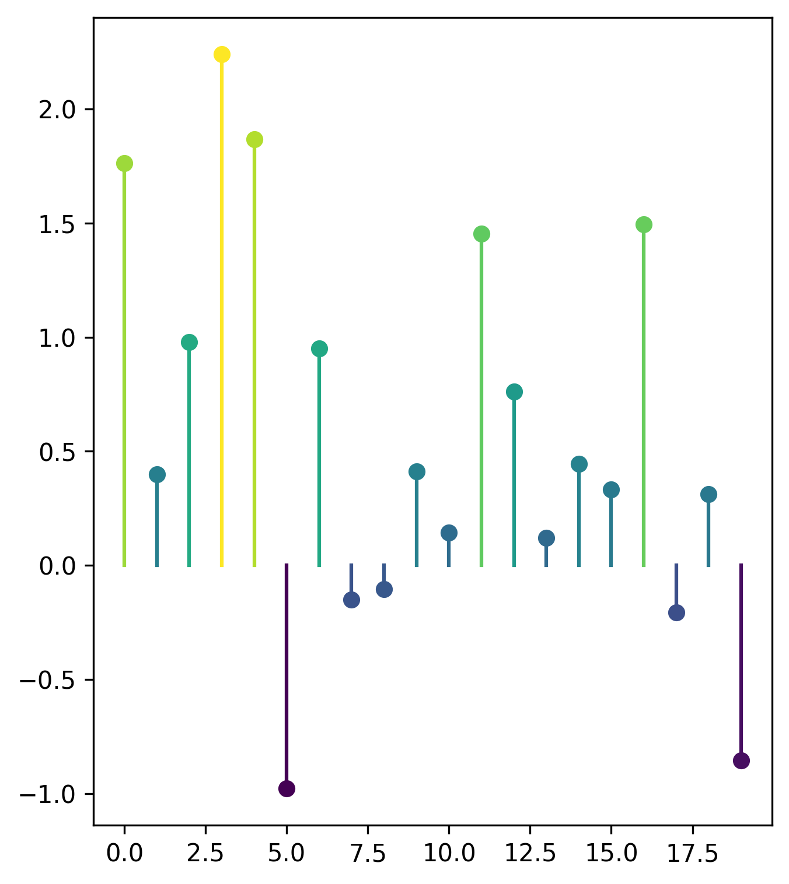

# dumbbell

### Install

```bash
pip install git+https://github.com/JosephBARBIERDARNAL/dumbbell.git
```

<br/><br/>

### Quick start

```python
import matplotlib.pyplot as plt
import numpy as np
import pandas as pd

from dumbbell import lollipop

np.random.seed(0)
x = list(range(20))
y = np.random.normal(size=20)
df = pd.DataFrame({"x": x, "y": y})

fig, ax = plt.subplots(figsize=(5, 6))
lollipop(
    x=df["x"],
    y=df["y"],
    c=df["y"],
    kind="vertical",
)

plt.show()
```


